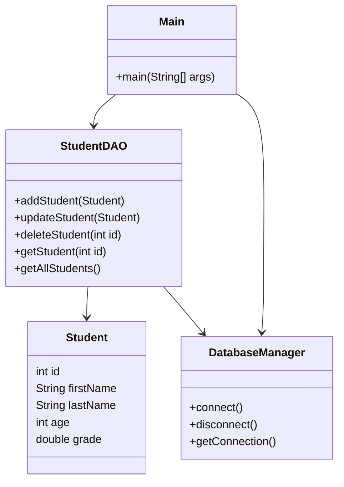

# StudentTracker - Class Architecture Documentation

## Overview
This document describes the core classes and architecture of the StudentTracker backend application (console version).

## Class Diagram (Mermaid)

## Class Descriptions

### `Student`
Represents a student entity with the following fields:
- `id`: Unique identifier (int)
- `firstName`: Student's first name (String)
- `lastName`: Student's last name (String)
- `age`: Student's age (int)
- `grade`: Student's grade (double)

### `StudentDAO`
Handles all database operations related to students:
- `addStudent(Student)`: Adds a new student to the database
- `updateStudent(Student)`: Updates an existing student's information
- `deleteStudent(int id)`: Deletes a student by ID
- `getStudent(int id)`: Retrieves a student by ID
- `getAllStudents()`: Retrieves all students

### `DatabaseManager`
Manages the database connection:
- `connect()`: Establishes a connection to the database
- `disconnect()`: Closes the database connection
- `getConnection()`: Returns the current database connection

### `Main`
Entry point of the application. Handles user interaction and delegates operations to `StudentDAO` and `DatabaseManager`.

## Architecture Overview
- The application follows a layered architecture:
  - **Model Layer**: Contains the `Student` class.
  - **DAO Layer**: Contains `StudentDAO` for data access logic.
  - **Utility Layer**: Contains `DatabaseManager` for DB connection management.
  - **Main Layer**: Contains the main method and CLI logic.

- All database operations use prepared statements for security.
- Exception handling is implemented at each layer for robustness.

---

*This documentation will be updated as the project evolves and new features are added.* 