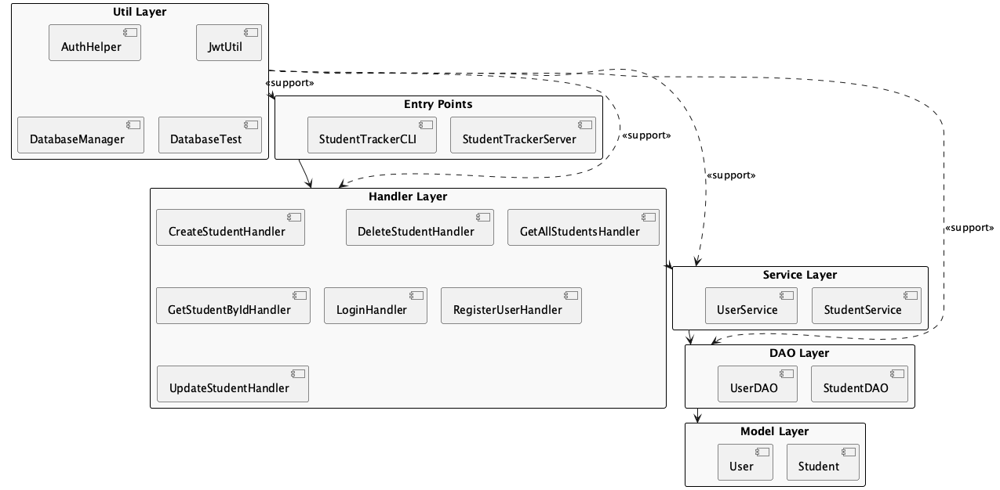

# Backend Layered Architecture

This document explains the layered architecture of the StudentTracker backend. The backend is organized into distinct layers, each with clear responsibilities and interactions, following best practices for maintainability and scalability.

## Layers Overview

- **Entry Points**: Main classes that start the application (e.g., `StudentTrackerServer`, `StudentTrackerCLI`).
- **Handler Layer**: Receives and processes HTTP or CLI requests. Each handler class (e.g., `CreateStudentHandler`, `LoginHandler`) is responsible for a specific endpoint or action.
- **Service Layer**: Contains business logic. Service classes (e.g., `StudentService`, `UserService`) coordinate operations, enforce rules, and mediate between handlers and DAOs.
- **DAO Layer**: Data Access Objects (e.g., `StudentDAO`, `UserDAO`) handle all interactions with the database, providing CRUD operations for models.
- **Model Layer**: Plain Old Java Objects (POJOs) representing core entities (e.g., `Student`, `User`).
- **Util Layer**: Utility classes (e.g., `AuthHelper`, `JwtUtil`, `DatabaseManager`) provide supporting functionality such as authentication, JWT handling, and database connection management.

## Layer Interactions

- Entry Points initialize the application and route requests to the appropriate handlers.
- Handlers receive requests, validate input, and delegate business logic to services.
- Services implement business rules and interact with DAOs to access or modify data.
- DAOs perform database operations and return model objects.
- Models are used throughout the application to represent data.
- Utility classes support all layers as needed.

## Diagram

See the following diagram for a visual representation of the backend layered architecture:

 