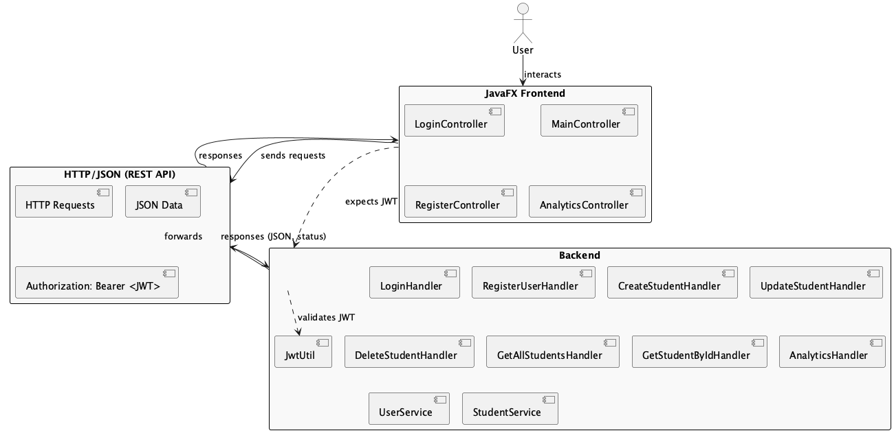

# Backend–Frontend Integration

This document explains how the JavaFX frontend (GUI) and the backend (REST API/server) interact in the StudentTracker application.

## Communication Flow

- The frontend communicates with the backend exclusively via HTTP requests (REST API).
- Controllers in the GUI (e.g., `MainController`, `LoginController`, `RegisterController`, `AnalyticsController`) send requests to backend endpoints to perform actions such as authentication, student management, and analytics retrieval.
- Data is exchanged in JSON format.

## Authentication

- User authentication is handled via JWT (JSON Web Token).
- On login or registration, the backend issues a JWT, which the frontend stores in memory.
- For all subsequent requests requiring authentication, the frontend includes the JWT in the `Authorization: Bearer <token>` HTTP header.
- The backend validates the JWT for protected endpoints.

## Data Exchange

- **Student Management:**
  - The frontend sends HTTP requests to create, update, delete, and fetch students.
  - The backend responds with JSON data representing students or operation status.
- **Search and Sorting:**
  - After fetching student data from the backend, the frontend provides search and sorting functionalities.
  - Search allows users to filter students by name or other attributes directly in the UI.
  - Sorting enables users to order the displayed students by columns such as first name, last name, age, or grade.
  - Both search and sorting are performed locally in the frontend on the fetched data, without additional backend requests.
- **Analytics:**
  - The frontend requests analytics data, which the backend computes and returns as JSON.
- **PDF Export:**
  - The frontend fetches student data from the backend via an HTTP request.
  - The frontend then generates the PDF locally using the received data.

## Error Handling

- The backend returns appropriate HTTP status codes and error messages.
- The frontend displays error alerts to the user based on backend responses (e.g., failed authentication, validation errors, network issues).

## Diagram

See the following diagram for a visual representation of the backend–frontend integration:

 