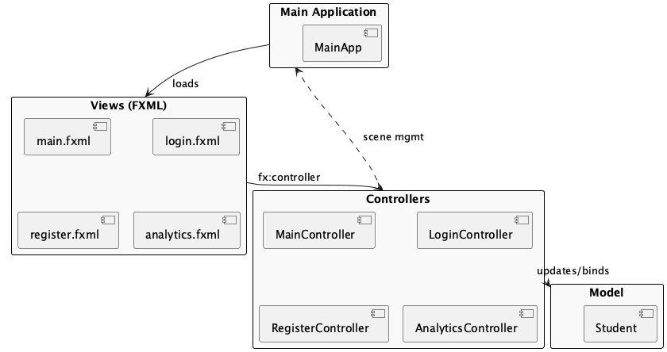

# Frontend GUI Architecture

This document explains the structure and design pattern of the StudentTracker frontend GUI, implemented using JavaFX.

## Design Pattern: MVC (Model-View-Controller)

The GUI follows the Model-View-Controller (MVC) pattern:

- **Model:** Represents the data and business logic. In the GUI, the `Student` class is the primary model, mirroring the backend's student entity.
- **View:** Defines the user interface layout. FXML files (`main.fxml`, `login.fxml`, `register.fxml`, `analytics.fxml`) describe the structure and appearance of each screen.
- **Controller:** Handles user interactions and updates the view and model. Each FXML file has a corresponding controller class (`MainController`, `LoginController`, `RegisterController`, `AnalyticsController`).

## Component Overview

- **FXML Views:**
  - Define the UI for each screen.
  - Are loaded by the JavaFX runtime and linked to controllers via the `fx:controller` attribute.
- **Controllers:**
  - Contain logic for handling user actions (button clicks, form submissions).
  - Interact with the model and update the view accordingly.
  - Communicate with the backend via HTTP requests.
- **Model Classes:**
  - Represent data displayed in the UI (e.g., `Student`).
  - Used for data binding in TableViews and forms.
- **Main Application:**
  - `MainApp` initializes the JavaFX application and manages scene transitions.

## Interactions

- The user interacts with the view (FXML UI), triggering events handled by the controller.
- The controller updates the model and/or sends requests to the backend.
- The controller updates the view based on responses or model changes.

## Diagram

See the following diagram for a visual representation of the frontend GUI architecture:

 