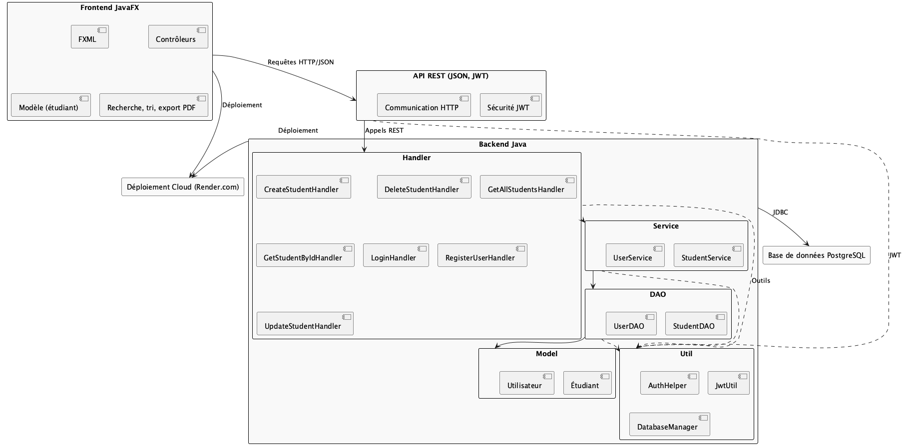

# Vue d'ensemble de l'architecture

Ce document présente l'architecture modulaire du projet Student Tracker.

## Structure du projet

- **Backend Java** :
  - Couches distinctes :
    - **DAO** : Accès aux données et gestion de la base PostgreSQL
    - **Service** : Logique métier et coordination
    - **Handler** : Gestion des requêtes HTTP (API REST)
    - **Model** : Représentation des entités (étudiant, utilisateur)
    - **Util** : Outils (authentification JWT, gestion de la base)
- **Frontend JavaFX** :
  - Interface graphique moderne (FXML, contrôleurs, modèles)
  - Recherche, tri, export PDF, tableau de bord analytique
- **Intégration** :
  - Communication via API REST (JSON)
  - Sécurité assurée par JWT
  - Déploiement cloud (Render.com)

## Schéma d'architecture

 